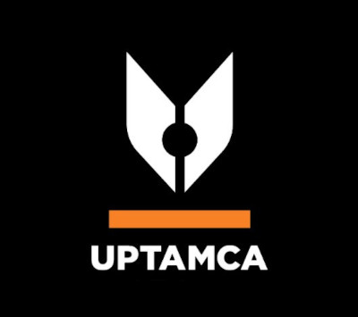

# 👋 ¡Bienvenidos al repositorio de la Unidad Curricular: PROGRAMACI&#243;N! 

Espacio colaborativo para los proyectos acad&#233;micos 🎓 de **UPTAMCA/Programaci&#243;n**

Este repositorio es la puerta de entrada a la Organizaci&#243;n de GitHub que utilizaremos durante el a&#241;o acad&#233;mico para gestionar, colaborar y evaluar todos nuestros proyectos grupales. Aqu&#237; encontrar&#225;s los principios, las reglas de colaboraci&#243;n y los enlaces clave para empezar.

## 🎯 Nuestra Misi&#243;n y Principios

En esta organizaci&#243;n, aprender&#225;s a trabajar como un equipo de desarrollo profesional 🤝 y aplicar los conceptos aprendidos en clase 📚 :

1. **Colaboraci&#243;n:** Utilizamos ramas (branches), *pull requests* (PRs) y revisiones de c&#243;digo para integrar el trabajo.

2. **Transparencia:** Todo el progreso del proyecto debe estar visible aqu&#237; en GitHub.

3. **Calidad:** Aplicamos est&#225;ndares de c&#243;digo limpio y utilizamos *Issues* para gestionar tareas y errores.

4. **Versionado:** Cada entrega importante deber&#225; ser etiquetada como un *Release* (Etiqueta).

## 📌 Normas de Uso

1. Mantener un lenguaje respetuoso y profesional ✨

2. Documentar claramente el c&#243;digo y cada avance en el repositorio 📝

- > ⚠️ Se debe escribir los nombres: de las ramas, los *commits*, los **PRs**, de m&#233;todos, variables, clases, interfaces, etc.. todo debe ser en **INGLES**

3. Usar ramas para nuevas funcionalidades o correcciones 🌿  

4. Hacer *commits* frecuentes y descriptivos 🖊️  

5. Respetar las fechas de entrega ⏰ 

## 🛠️ Gu&#237;a de Inicio R&#225;pido para Estudiantes

Sigue estos pasos para comenzar a trabajar en tu proyecto:

### 1. Ubica tu Repositorio

Tu repositorio se llama con el siguiente formato: `[A&#241;o]-T[N&#250;meroTrayecto][N&#250;meroDeSecci&#243;n]-G[N&#250;meroDeGrupo]` .

- Ejemplo: `2025-T101-G01`

- Acceso: Si eres miembro del grupo, ya tienes acceso de escritura al repositorio.

### 2. Clonaci&#243;n Inicial

Cada miembro debe clonar el repositorio de su proyecto a su m&#225;quina local.

```bash
# Cambia 'nombre-repo' por el nombre de tu proyecto

git clone https://github.com/UPTAMCA/nombre-repo.git
```

### 3. ¡Crea una Rama! (Branching)

> ⚠️ **Regla de Oro:** **NUNCA** trabajes directamente en la rama `main` o `master`.

Siempre crea una rama nueva para cada nueva funcionalidad o correcci&#243;n que vayas a implementar.

```bash
# Crea y cambia a tu nueva rama (ejemplo: 'feat/usuario')

git checkout -b <tipo>/<descripcion-corta>
```

### 4. Flujo de Trabajo (Pull Requests y Revision)

Cuando termines una tarea y tu c&#243;digo est&#233; listo, sigue este flujo:

1. Haz *push* de tu rama a GitHub.

2. Crea un **Pull Request (PR)** para fusionarla con la rama `main`.

3. **Etiqueta (Assign)** a tu **L&#237;der de Grupo** y/o al **Profesor** para revisi&#243;n.

4. Solo se fusionar&#225; el c&#243;digo que haya sido aprobado por al menos un revisor.

## 🔗 Enlaces Importantes

| Recurso                  | Descripci&#243;n     | Enlace        |
|:-------------------------|:----------------|:-------------:|
| Pol&#237;tica de Git          | Reglas de nombramiento de ramas y commits.                            | [Reglas de Nombramiento](docs/Convention.md)      |
| Tutorial de GitHub       | Si eres nuevo, esta gu&#237;a te ayudar&#225; con el entorno.                   | [Tutorial B&#225;sico](https://docs.github.com/es/get-started) |
| Pr&#225;cticas                | Canal de Youtube 🎥                                                   | [Pr&#225;cticas](www.youtube.com/@cgedler) |

## 🌟 Recuerda: 

> Este espacio no es solo para programar, sino para **aprender a trabajar en equipo, comunicar ideas y construir soluciones reales**.  
> ¡Cada repositorio es una oportunidad para crecer como desarrolladores y como profesionales! 💡

## 📧 Contacto con el Profesor

Si tienes alg&#250;n problema con el acceso, permisos o la estructura de la organizaci&#243;n, puedes contactarme en:

- **Email:** `cge.uptamca@gmail.com`

- **Horario de Oficina:** de lunes a viernes, de 9:00 a 18:00

#### &#250;ltima Actualizaci&#243;n: [Fecha de Hoy]